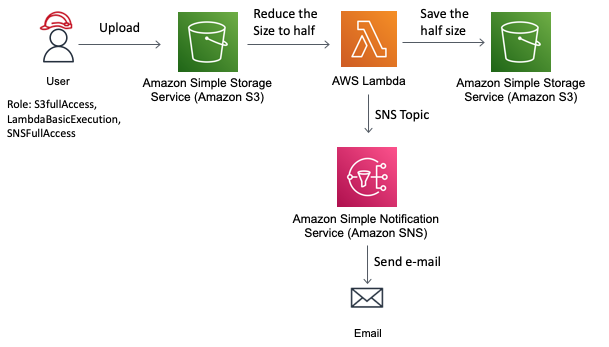

<html>

<h1> 
 How to Run 
 </h1>

  

<h4>terraform init -> to download the provider(AWS)</h4>
<h4>terraform fmt -> to formatize the code</h4>
<h4>terraform validate -> to validate the syntax errors</h4>
<h4>terraform plan -> to see the blueprint</h4>
<h4>terraform apply --auto-approve -> to create the infrastructure </h4>
<h4>terraform destroy --auto-approve -> to destroy the created infrastructure</h4>

<h4>When you are going to run first time you will get errors, you can see the below image
    But remember, you have to accept the subscription mail of AWS Notification. Open the mail and click on the link.</h4>

 

<h4>It is Because the dependency resources has not been created.</h4>

</h4>Now, run again because this time, almost every dependency has been created except one which lambda layer.</h4>

    <h4>
So, to do that run again.

Now, this time you will not get any error and the infrastructure will be created completed.
But to receive the AWS Notifications via SNS(Noted: you've confirmed the subscription message which sent on Mail by AWS Notification). Refresh the terraform state file by running the same command last time. 
Here, you have completely created your lambda Services.
    </h4>

</html>