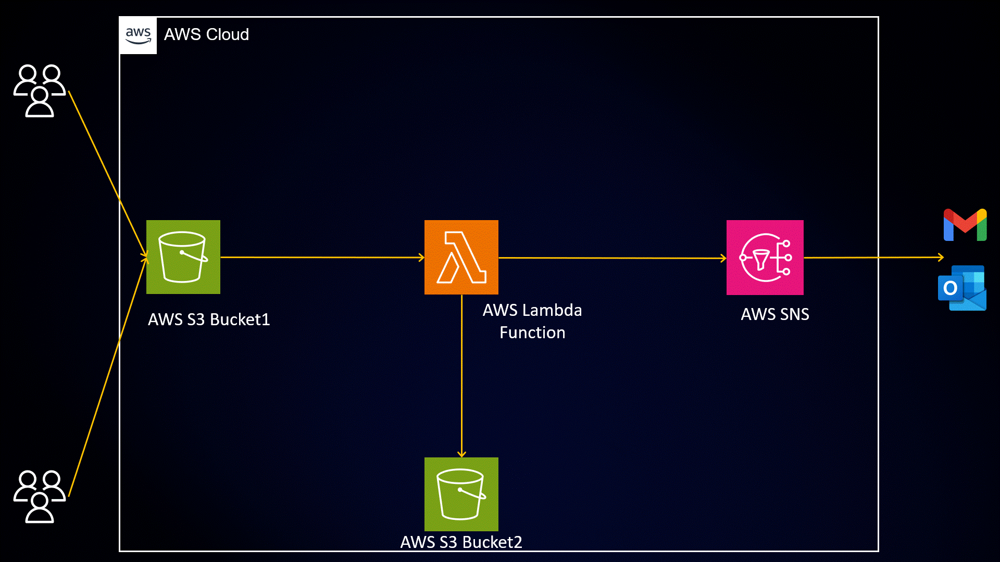

# Image Resizing Automation using AWS S3, Lambda, and SNS

Automating the image resizing process has never been easier! This project demonstrates how to leverage the power of serverless architecture to automate image 
resizing using AWS S3, Lambda, and SNS.

## Table of Contents

- [Introduction](#introduction)
- [Features](#features)
- [Prerequisites](#prerequisites)
- [Getting Started](#getting-started)
- [Architecture](#architecture)
- [Deployment](#deployment)
- [Usage](#usage)
- [Contributing](#contributing)
- [License](#license)

## Introduction

In today's digital era, images are an integral part of applications and websites. However, managing different image sizes manually can be a time-consuming and error-prone task. This project aims to automate the image resizing process, saving you valuable time and effort.

## Features

- Automatic image resizing based on predefined dimensions.
- Seamless integration with AWS S3, Lambda, and SNS.
- Real-time email notifications about successful image resizing.
- Scalable and cost-effective serverless architecture.
- Easily adaptable to fit your specific image resizing requirements.

## Prerequisites

To get started with this project, ensure you have the following prerequisites:

- An AWS account with appropriate permissions.
- Basic knowledge of AWS S3, Lambda, and SNS services.
- Familiarity with Python programming language.
- Development environment set up with AWS CLI and Boto3 installed.

## Getting Started

Follow these steps to set up and deploy the image resizing automation:

1. Clone this repository to your local machine.
2. Configure your AWS credentials using the AWS CLI.
3. Create two S3 buckets: one for the original images and another for the resized images.
4. Create an SNS topic and subscription to receive email notifications.
5. Customize the Lambda function code with your S3 bucket names and SNS topic ARN.
6. Deploy the Lambda function and associated resources using the provided Terraform scripts (optional).
7. Test the automation by uploading images to the original image bucket.

For detailed instructions and code snippets, refer to the [full blog post](#https://medium.com/devops-dev/end-to-end-image-resizing-pipeline-with-aws-s3-lambda-and-sns-a-step-by-step-guide-94e42124ec0d) associated with this project.

## Architecture

The image resizing automation leverages the following AWS services:

- **AWS S3**: Stores the original and resized images.
- **AWS Lambda**: Executes the image resizing code in a serverless environment.
- **AWS SNS**: Sends email notifications about successful image resizing.

## Deployment

You have two options for deploying this project:

- **Manual Approach**: Follow the step-by-step instructions in the [Getting Started](#getting-started) section to manually create and configure the required AWS resources.

- **Terraform Approach**: If you prefer infrastructure as code, use the provided Terraform scripts in the `terraform/` directory. Update the variables in `variables.tf` to match your requirements, and then run `terraform apply` to provision the necessary resources.

## Usage

Once the image resizing automation is deployed, follow these steps to use it:

1. Upload the images you want to resize to the original image bucket.
2. The Lambda function will automatically resize the images and store them in the resized image bucket.
3. You will receive an email notification with details about the successful image resizing process.

## Contributing

Contributions are welcome! If you have any ideas, suggestions, or bug reports, please open an issue or submit a pull request.

## License

This project is licensed under the [MIT License](LICENSE).

Let's automate image resizing and simplify your image management workflow with AWS S3, Lambda, and SNS. Feel free to explore the project, customize it to your needs, and take advantage of the power of serverless architecture!

For detailed instructions and a more in-depth guide, check out the [full blog post](https://medium.com/@aman.pathak_51134/end-to-end-image-resizing-pipeline-with-aws-s3-lambda-and-sns-a-step-by-step-guide-94e42124ec0d).

Stay tuned for more exciting projects and updates by following me on [LinkedIn](https://www.linkedin.com/in/aman-devops/) or [GitHub](https://github.com/AmanPathak-DevOps). Let's connect and collaborate! 🚀🌟

