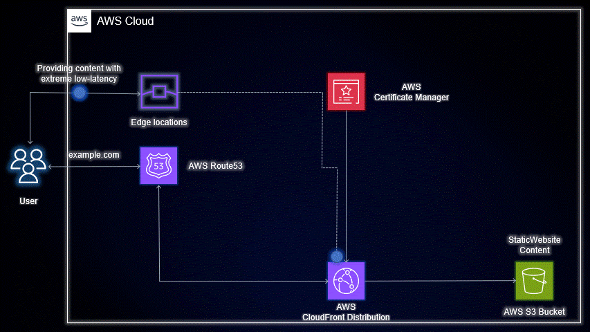

# Project Name: CloudSpark 🌟

**Welcome to CloudSpark!** 🔥✨

CloudSpark is a powerful and easy-to-use Terraform project that unleashes the full potential of AWS services to build your own blazing-fast and secure static website. Whether you're a seasoned developer or just starting your AWS journey, CloudSpark is designed to make your website creation process a breeze! 🚀

## 🌐 Why CloudSpark?

- **Speed Matters:** Say goodbye to slow-loading websites! CloudSpark leverages AWS services like S3 and CloudFront CDN to deliver your website content at lightning speed.

- **Fortress of Security:** With ACM SSL certificate integration, CloudSpark ensures that your website enjoys the highest level of data security, gaining your visitors' trust.

- **Flexibility at Its Finest:** CloudSpark offers two approaches - a quick Terraform setup or an in-depth manual journey - giving you the freedom to choose your adventure! 🧭

## 🚀 Quick Setup with Terraform

1. Clone this repository to your local machine.

2. Install Terraform and configure your AWS credentials.

3. Explore the `terraform` folder to access our ready-to-go Terraform module.

4. Customize the variables in `variables.tf` to match your preferences.

5. Run `terraform init`, `terraform plan`, and `terraform apply`.

6. Voilà! Your website is live and ready to shine! 🌟

## 🌟 Manual Approach - Your AWS Masterclass

Prefer a deeper understanding of each component? We've got you covered! Check out the <a href="https://medium.com/@aman.pathak_51134/empower-your-website-a-step-by-step-guide-to-building-a-secure-and-blazing-fast-aws-s3-website-c49d37bff4d7">Medium Blog</a> for an in-depth AWS masterclass on building your website from scratch. 🤓

## 🏆 Show Off Your CloudSpark Website!

We can't wait to see your masterpiece! Share your CloudSpark-powered website with the world and tag us on social media using **#CloudSparkProject** and **@your_username**. Your success story might be featured on our website! 🎉

## Show Your CloudSpark:

Join us in this cloud-deployment expedition! Share your experiences, learnings, and victories with the hashtag #CloudSpark. Let's deliver our Static Website with extreme low-latency together! 🌥️💸

LinkedIn Profile: <a href="https://www.linkedin.com/in/aman-devops/">Aman Pathak</a>

Enjoy the journey with CloudSpark and let's spark the web together! 🚀✨

Let the cloud savings begin! Happy Deployment! 🎯💰

## 🤝 Contributing

We welcome contributions from the community! If you have any cool ideas or improvements, submit a pull request. Together, we'll make CloudSpark even better! 🙌

## License

This project is licensed under the [MIT License](LICENSE).
