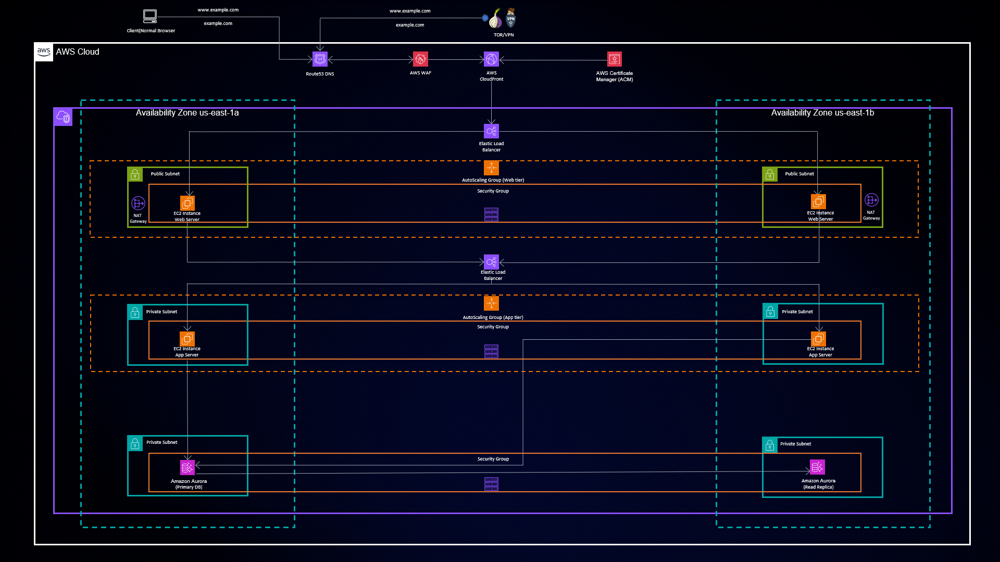

# Three-Tier Architecture Deployment on AWS with Terraform

 </img>

## Introduction

Welcome to the realm of Three-Tier Architecture deployment on Amazon Web Services (AWS) made simple and efficient with Terraform. This repository serves as your gateway to effortlessly setting up a robust and scalable Three-Tier Architecture for your applications. Harness the power of Infrastructure as Code (IaC) and streamline your deployment process like never before.

## Project Overview

This project takes the complexity out of deploying a Three-Tier Architecture on AWS. By automating the creation of your entire infrastructure, it allows you to focus on what matters most – your application's core logic. Whether you're a seasoned developer or new to the AWS ecosystem, this project empowers you to spin up a complete environment with minimal effort.

## Getting Started

1. Clone the repository: `git clone https://github.com/AmanPathak-DevOps/Terraform-for-AWS.git`
2. Navigate to `Non-Modularized/Three-Tier-Application/` directory.
3. Configure your architecture in `<services>.tf` following the detailed comments.

## Project Highlights

- **VPC: The Foundation**: Create a secure Virtual Private Cloud (VPC) to isolate your application.
- **Load Balancing Magic**: Harness the power of the Application Load Balancer (ALB) for optimal traffic distribution.
- **Auto Scaling Wonders**: Leverage Auto Scaling Group to ensure performance and resilience.
- **Database Sorcery**: Deploy Amazon RDS for managed database services.
- **DNS Mastery**: Use Route 53 for domain registration and DNS management.
- **Static Content Wizardry**: Utilize Amazon S3 to manage static assets/code.

## Detailed Guide

For an in-depth walkthrough of the project, check out the detailed guide on [Medium](https://medium.com/@aman.pathak_51134/mastering-three-tier-architecture-deployment-on-aws-with-terraform-f43e84be1edd).

## Connect with Us

- GitHub: [GitHub Profile](https://github.com/AmanPathak-DevOps)
- LinkedIn: [LinkedIn Profile](https://www.linkedin.com/in/aman-devops/)

## Contributions

Feel free to contribute and adapt this project to suit your needs. We welcome your ideas and improvements.

## License

This project is licensed under the [MIT License](LICENSE).